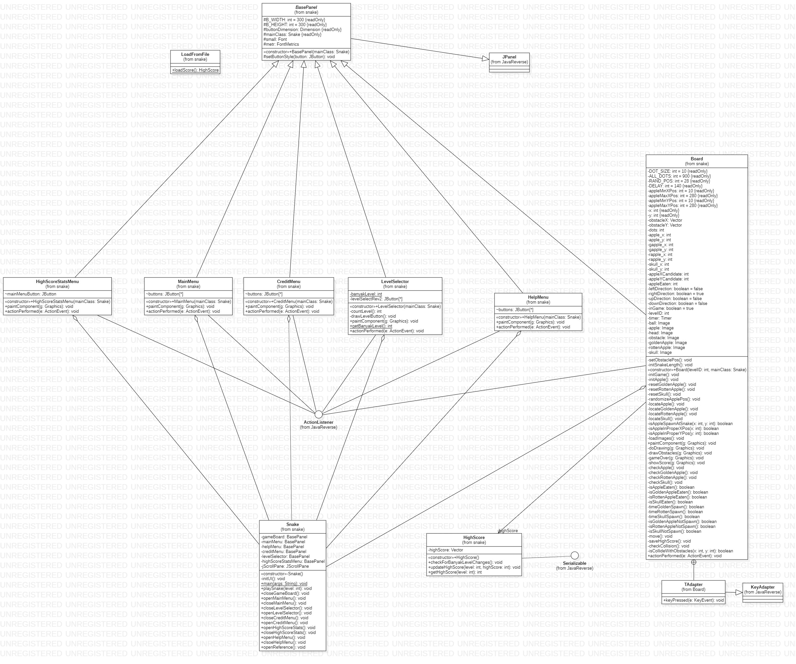

# Snake (Game)
## Diagram Kelas

## Penjelasan Singkat
Sebuah permainan legendaris yang mengharuskan kita untuk memberi makan ular hingga panjang dan tidak boleh mati (tertabrak dirinya sendiri, tembok maupun ikon tengkorak).

## Fitur
- Terdiri dari 5 level, dengan masing-masing tingkat kesulitan yang berbeda.
- Setiap level dapat menyimpan high score berbeda.
- Bantuan untuk jenis-jenis *spawnable*
- Profil Developer
- Referensi.

## Penjelasan Kelas
### BasePanel
BasePanel ini hanyalah kelas abstrak yang menjadi *parent* dari menu-menu lain dan game utama. Kelas ini dibuat karena kelas-kelas lain memiliki beberapa *field* dan metode yang sama. Contoh kesamaan *field*-nya adalah B_WIDTH dan B_HEIGHT yang akan sama-sama bernilai 300 di semua kelas. Lalu kesamaan metode ada pada setButtonStyle(JButton) yang berfungsi untuk mengatur *style* dari tombol-tombol yang ada pada program ini.
### Board
Board merupakan kelas yang berisikan logika dari permainan ini. Kelas ini akan menginisialisasi semua aset gambar, *load obstacles*, mengatur *behaviour* dari ular, memeriksa tabrakan antara kepala ular dengan elemen lain, mengatur posisi kemunculan apel maupun tengkorak, lalu yang terakhir adalah memunculkan menu game over apabila ular mati.
### CreditMenu
Kelas ini berfungsi menampilkan data kelompok kami, tombol menuju referensi, dan tombol kembali ke menu utama.
### HelpMenu
HelpMenu ini menampilkan mengenai keterangan *spawnable* yang tersedia pada permainan utama.
### HighScore
Kelas HighScore berisikan *array* yang menyimpan skor tertinggi dari setiap level. Kelas ini otomatis mendeteksi perubahan banyak level dan menyesuaikan data skornya.
### HighScoreStatsMenu
Menu ini menampilkan skor tertinggi dari semua level dengan memanggil kelas HighScore dan menuliskannya. Lalu ada tombol kembali ke menu utama.
### LevelSelector
Sesuai nama kelasnya, bagian ini berisikan daftar level yang bisa dimainkan dan sebuah tombol untuk ke menu utama. Seperti kelas HighScore, menu ini akan otomatis mendeteksi perubahan banyak level berdasarkan dari berkas aset yang ada.
### LoadFromFile
Kelas ini berfungsi untuk *deserialisable* kelas HighScore sesuai dengan kebutuhan dari kelas lain.
### MainMenu
Ini merupakan menu yang akan langsung dilihat ketika permainan dibuka. Menu utama berisi tombol *play, help, credit*, serta statistik skor tertinggi.
### Snake
Snake merupakan kelas yang mengatur *frame* dan *panel-panel*. Inisialisasi dari panel-panel lain akan dilakukan. Selain itu, transisi antar menu diatur dengan menggunakan *add(), remove()*, serta *setVisibility()*. Ketika tombol-tombol yang ada pada masing-masing menu ditekan, *actionPerformed()* dari setiap tombol akan memanggil salah satu dari aksi membuka/menutup menu yang ada pada kelas ini.

## Referensi dan Perubahan
Sumber utama *logic game* : <a href="http://zetcode.com/javagames/snake/">zetcode</a>
### Perubahan yang dilakukan
- Menambahkan menu utama.
- Mempersiapkan kelas Snake agar dapat mempersiapkan transisi antar menu.
- Menambahkan menu-menu untuk bantuan, kredit, statistik skor tertinggi.
- Penambahan menu untuk memilih level.
- Membuat kustomisasi dari JButton.
- Penggunaan JScrollPane untuk pemilihan level agar semua tombolnya bisa tampil di jendela berukuran 300x300.
- Penambahan *obstacle*, jenis apel lain, serta tengkorak untuk membuat game lebih bervariasi.
- Menampilkan skor saat game dimainkan.
- Menampilkan skor tertinggi pada saat permainan berakhir.
- Penggunaan *serializable* untuk menyimpan skor tertinggi.
- Penambahan lima jenis level.
- Membuat ular berpindah ke bagian berlawanan apabila menabrak ujung jendela permainan.
- Membuat aset tersendiri untuk level maupun gambar.
- Penggunaan kelas Desktop untuk membuka link di tab baru dari browser.